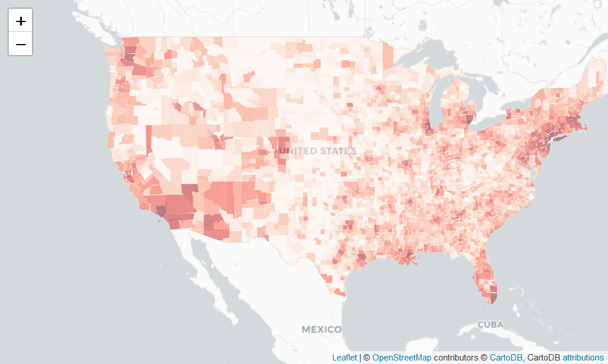
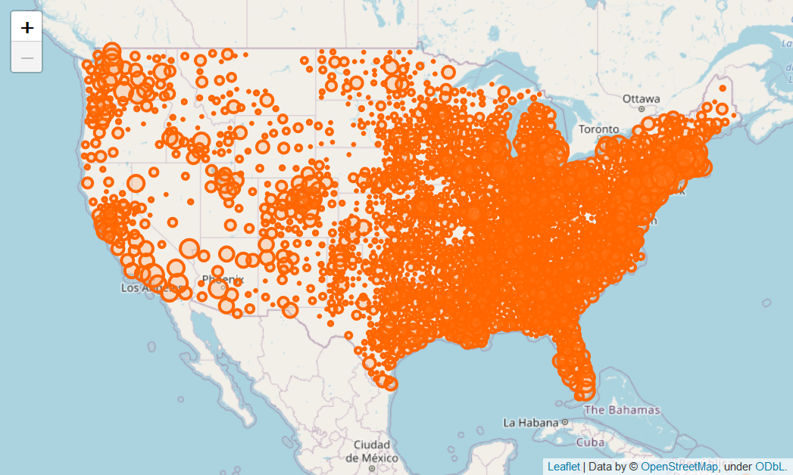
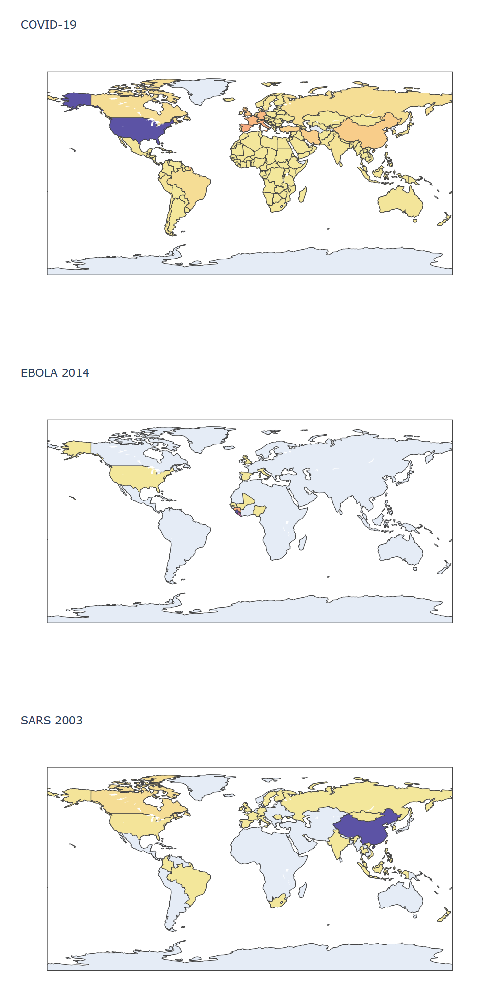
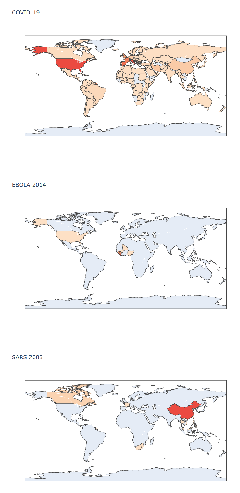

# Corona virus: Fact or Hype

	

# Table of Contents
- [Introduction](#Introduction)
- [Definitions](#Definitions)
- [Data Collection](#Data_Collection)
- [COVID-19 Analysis](#COVID-19_Analysis)
- [Comparison to Other Pandemics](#Comparison_to_Other_Pandemics)
- [SIR Model](#SIR_Model)
- [Stock Market Analysis](#Stock_Market_Analysis)
- [Great videos to watch](#Great_videos)
- [Conclusion](#Conclusion)
- [References](#References)

# Introduction <a name="Introduction"/>
Lets first note that both fact and hype exist in discussions regarding COVID-19.  This notebook will only consider data available from the Centers for Disease Control and Prevention (CDC) [[1](https://www.cdc.gov/coronavirus/2019-ncov/index.html)]  and World Health Organization (WHO) [[2](https://www.who.int/csr/don/12-january-2020-novel-coronavirus-china/en/)].  As Data Scientists, our job is to look at data to make informed data-driven decisions.

At the time of the writing of this notebook (**updated April 8, 2020**), the world has descended into mass panic, fueled by misinformation in media and social media.  In the stock market, the Dow-Jones Industrial Average dropped from 29,718 to 21,749 points, sending business and retirement accounts tumbling.

# Definitions <a name="Definitions"/>

## Corona Virus
- Coronaviruses are zoonotic viruses (transmitted between animals and people).
- Symptoms include: fever, cough, respiratory symptoms, and breathing difficulties.
- In severe cases, it can cause pneumonia, severe acute respiratory syndrome (SARS), kidney failure and even death.
- Coronaviruses are also asymptomatic, meaning a person can be a carrier of the infection but experience no symptoms.

## Novel coronavirus (nCoV)
- A novel coronavirus (nCoV) is a new strain that has not been previously identified in humans.

## COVID-19 (Corona Virus Disease 2019)
- Caused by a SARS-COV-2 corona virus.
- First identified in Wuhan, Hubei, China. Earliest reported symptoms reported in November 2019.
- First cases were linked to contact with the Huanan Seafood Wholesale Market that sold live animals.
- On January 30, 2020 the WHO declared the outbreak to be a Public Health Emergency of International Concern

# Data Collection <a name="Data_Collection"/>
So is COVID-19 really a pandemic? If so, how does it compare to other pandemics?  According to the CDC [[1](https://www.cdc.gov/coronavirus/2019-ncov/index.html)], COVID-19 **may** be 10x worse than the common flu, though some people will contract COVID-19 and have little to no symptoms whatsoever.

However, a recent article by Dr. Anthony Fauci, et.al., states that the COVID-19 models are very conservative, and the COVID-19 **mortality rate is considerably less than initial predictions** [[3](https://www.nejm.org/doi/full/10.1056/NEJMe2002387)].

If you are reading this notebook, you realize that you are more than a lay-person.  You have powerful tools at your fingertips ([Data Science](https://github.com/dsbc2020/ml_training/tree/master/notebooks/10-steps-to-DS), [Python](https://github.com/dsbc2020/ml_training/tree/master/notebooks/Python-in-2-days), and [Machine Learning](https://github.com/dsbc2020/ml_training/tree/master/notebooks/Machine-Learning-in-1-day)), and you likely have access to the [Coronavirus raw data](https://github.com/dsbc2020/ml_training/tree/master/notebooks/Examples/coronavirus/data) so that you can analyze and formulate your own opinion.  You realize that to be a Data Scientist requires you to be a creative and critical thinker... an individual.

Team DSBC had the same notion!

So we collected data from the CDC and WHO websites.  But we didn't stop there.  We are critical thinkers too.  We also collected data for:
- The COVID Tracking Project [[4](https://covidtracking.com/)]
- Coronavirus international incidence dates [[5](https://www.washington.edu/news/2020/02/07/interactive-map-shows-worldwide-spread-of-coronavirus/)]
- JHU Data sources [[6](https://github.com/CSSEGISandData/COVID-19)], [[7](https://github.com/imdevskp/covid_19_jhu_data_web_scrap_and_cleaning)]
- 2009 H1N1 Swine Flu [[8](https://academic.oup.com/cid/article/52/suppl_1/S75/499147#97947460)], [[9](https://www.cdc.gov/flu/spotlights/pandemic-global-estimates.htm)], [[10](http://www.cidrap.umn.edu/news-perspective/2011/08/study-puts-global-2009-h1n1-infection-rate-11-21)], [[11](https://www.cdc.gov/flu/pandemic-resources/2009-pandemic-timeline.html)], [[12](https://en.wikipedia.org/wiki/2009_flu_pandemic_timeline#March_2009)]
- Ebola [[13](https://www.cdc.gov/vhf/ebola/history/2014-2016-outbreak/case-counts.html)]
- SARS [[14](https://www.who.int/csr/sars/country/en/)]
- MERS [[15](https://hazards.colorado.edu/quick-response-report/dynamics-of-interorganizational-risk-management-networks-during-the-2015-mers-response-in-south-korea)]
- 1918 Spanish Flu [[16](https://www.cdc.gov/flu/pandemic-resources/1918-commemoration/pandemic-timeline-1918.htm)], [[17](https://wwwnc.cdc.gov/eid/article/12/1/05-0979_article)]

Just for completeness, we also collected data on:
- Stock Prices: DJIA [[18](https://www.wsj.com/market-data/quotes/index/DJIA/historical-prices)], NASDAQ [[19](https://www.wsj.com/market-data/quotes/index/COMP/historical-prices)], and the S&P 500 [[20](https://www.wsj.com/market-data/quotes/index/SPX/historical-prices)]
- Car crashes [[21](https://www.asirt.org/safe-travel/road-safety-facts/)]
- Suicides [[22](https://www.medicalnewstoday.com/articles/234219.php#1)]
- Cancer [[23](https://www.who.int/news-room/fact-sheets/detail/cancer)]
- Ischemic Heart Disease [[24](https://www.ahajournals.org/doi/10.1161/CIRCOUTCOMES.118.005375)]
- Generic US Flu [[25](https://www.cdc.gov/flu/about/burden/preliminary-in-season-estimates.htm)]
- Stroke [[26](http://www.strokecenter.org/patients/about-stroke/stroke-statistics/)]
- Drowning [[27](https://www.who.int/news-room/fact-sheets/detail/drowning)]
- Bed strangulation [[28](https://www.businessinsider.com/weird-causes-of-death-2016-7#w75-accidental-suffocation-and-strangulation-in-bed--10206-deaths-7)], [[29](https://wonder.cdc.gov/controller/datarequest/D76)]
- SIDS [[30]](https://pediatrics.aappublications.org/content/pediatrics/122/3/660.full.pdf?download=true)]
- Domestic Violence [[31](https://www.npr.org/sections/goatsandsoda/2018/11/30/671872574/u-n-report-50-000-women-a-year-are-killed-by-intimate-partners-family-members)]
- Animal deaths [[32](https://www.businessinsider.com/worlds-deadliest-animals-2016-9/)]
- Alzheimer's [[33](https://braintest.com/alzheimers-statistics-throughout-the-united-states-and-worldwide/)]
- Malaria [[34](https://www.childfund.org/infographic/malaria/)]
- Homicide [[35](https://ourworldindata.org/homicides)]

# COVID-19 Analysis <a name="COVID-19_Analysis"/>
## Background
The CDC estimates [[36](https://www.cdc.gov/coronavirus/2019-ncov/index.html)] that COVID-19 will be 10 times more deadly than the common flu.  This means that if the common flu related deaths is 52,000 for the USA in 2020, the expected number of deaths for COVID-19 is 520,000.  If the US population in the year 2020 is 329,227,746 people [[37](https://www.census.gov)], the percent of the population that will likely die of COVID-19 is 0.16%:

	(520,000 / 329,227,746) * 100 = 0.157%
	
The current death rate (April 8, 2020) is 0.004% (roughly 4 in every 1,000 people):
	
	(12,733 / 329,227,746) * 100 = 0.004%
	
Compare this to the cancer, 2.915% (roughly 3 in every 100 people):

	(9,600,000 / 329,227,746) * 100 = 2.915%

**According to the CDC, epidemics like the Coronavirus initially follow an exponential growth model**, then reach an inflection point, before subsiding.  The curve (called a Sigmoid function) looks like this:

	

This model can be expressed mathematically as

	f(x) = 1 / (1 + exp(-x)).  
	
To track the epidemic in real-time, the CDC does not track the total number of deaths, rather they track the rate of change, i.e. the first derivative of the sigmoid  

	f'(x) = f(x) * (1 - f(x)).  

This means that **the CDC track the slope (or rate of change) of the Sigmoid.**  When the rate of change decreases, the inflection point has passed and the "end is in sight."  Effectively, you could estimate the total number of deaths by doubling the number of deaths prior to the inflection point.

If you are still having trouble with this Sigmoid concept, watch this great [YouTube video](https://youtu.be/Kas0tIxDvrg).

## Cases
If we look at the China data for the *number of cases*, this does appear to look like a Sigmoid function.  This may indicate that the end is in sight for China.  Maybe the rest of the world is soon to follow.

	

	

	

## Maps - World
Confirmed cases by country

	

Deaths by country

	

## Maps - USA 
Confirmed cases by state

	

Deaths by state

	

Confirmed cases by county

	

Confirmed Cases by County (circle size indicates number of cases)

	

## Block Chart
The size of the *overall block* represents the *total of all countries*.  The size of *each block* represents the number of cases/recovered/deaths in that *country*.

	

# Comparison to Other Pandemics <a name="Comparison_to_Other_Pandemics"/>
So how does COVID-19 compare to other pandemics?  Here is a comparison of COVID-19, Ebola and SARS.  Colors (yellow to purple) indicate the number of confirmed cases.  Clearly COVID-19 is much more wide-spread.  Note that this might have some relation to the increased global ability to test, track and confirm viruses in 2020 compared to 2003.

## Comparison
Cases

	

Deaths

	

	

	

	

	

## Averages
The following is the number of *DEATHS PER DAY ON AVERAGE* from the links above.
- Cancer = 26,302
- Heart Disease = 24,658
- Diabetes = 3,753
- Car accidents = 3,287
- Suicides= 3,000
- HIV AIDS = 2,615
- Alzheimer = 1,918
- Malaria = 1,200
- Homicide = 1,111
- COVID-19 = 909
- Drowning = 877
- Alcohol_disorder = 507
- Fire = 331
- Stroke = 384 (USA only)
- Common Flu = 143 (USA only)
- Domestic Violence = 137
- Bed strangulation = 28 (USA only)
- Natural disasters= 26
- SIDS = 7

The result of *WORLD-WIDE DEATHS PER DAY* is shown here.    

	

Here is another plot showing the top causes of *death per YEAR*.

	

# SIR Model <a name="SIR_Model"/>
Applying the models found in the literature [38],[39],[40] we can evaluate the spread of a virus by splitting the population into three categories, *Susceptible*, *Infected*, and *Recovered*.  Then using a partial differential equation (recall your calculus), we can solve the rate of change of each category.

The weights (or constants) are the Transmission Rate (CDC example: a = 3.2), and Recovery Rate (CDC example: b = 0.23).

The Susceptible Equation, meaning the rate at which the Susceptible population is affected over time:

	ds/dt = -a * s(t) * i(t)

The Recovered Equation, meaning the rate at which the Recovered population is affected over time: 

	dr/dt = b * i(t)

The Infected Equation, meaning the rate at which the Infected population is affected over time. First we know that the three partial derivatives must balance each other, meaning the equations depend on each other and together cannot exceed 100% of the population:

	ds/dt + di/dt + dr/dt = 0

therefore,

	di/dt = a * s(t) * i(t) - b * i(t)

We can then evaluate the equations with various weights, first consider the case where we hold the Recovery Rate fixed. Notice that if the Transmission Rate is low (a=0.5), the Susceptible population never reaches 0, meaning that the entire population is not affected by the virus, only a portion of it.  Conversely, if the Transmission Rate is high (a=3.2, as expected by the CDC for COVID-19) then the entire population is affected.  The logical solution to reduce Transmission Rate is to reduce the interactions within the population.

	

Now consider the case if we hold the Transmission Rate fixed, and vary the Recovery Rate.  If the Recovery Rate is low (ex: b=0.23), the Infected Population is prolonged in time.  Whereas if the Recovery Rate is high (ex: b=0.95), the Infected Population is reduced in time and the Susceptible Population never reaches 100%.  Notice that for b=0.95, the Recovered Population never reaches 1, this is because the Susceptible Population never reaches 0.

	

# Stock Market Analysis <a name="Stock_Market_Analysis"/>
During times of crisis, the stock market tends to be volatile.  Many people panic and consider liquidating their 401k and other retirement accounts. As Data Scientists we have data to evaluate.  We pulled data from the following:
- Dow Jones Industrial Average: [[18](https://www.wsj.com/market-data/quotes/index/DJIA/historical-prices)], [[41](https://www.macrotrends.net/1319/dow-jones-100-year-historical-chart)]
- NASDAQ: [[19](https://www.wsj.com/market-data/quotes/index/COMP/historical-prices)], [[42](https://www.macrotrends.net/1320/nasdaq-historical-chart)]
- S&P 500: [[20](https://www.wsj.com/market-data/quotes/index/SPX/historical-prices)], [[43](https://www.macrotrends.net/2324/sp-500-historical-chart-data)]
 
The figure below provides the daily closing for DJIA, S&P 500, and NASDAQ from 03/20/2000 to 03/20/2020.  Notice that after the 9/11 attacks in 2001, the market recovered in 61 days (just before Christmas).  In the 2008 Recession, the market recovered in 532 days (1 year, 5 months).  **In all cases the market recovered**, so be mindful when you panic and consider liquidating your retirement accounts and investments.

	

# Great Videos to Watch <a name="Great_videos"/>
 - ["Exponential growth and epidemics"](https://youtu.be/Kas0tIxDvrg)
 - ["Understanding R nought | Khan Academy"](https://youtu.be/jKUGZvW99os)
 - ["Estimating actual COVID 19 cases (novel corona virus infections) in an area based on deaths"](https://youtu.be/mCa0JXEwDEk)
 - ["How To Tell If We're Beating COVID-19"](https://youtu.be/54XLXg4fYsc)
 - ["How To See Germs Spread - Coronavirus"](https://youtu.be/I5-dI74zxPg)
 - ["We heard the bells: The influenza of 1918"](https://youtu.be/XkGi9FKZzDI)
 - ["1918 Spanish Flu historical documentary | Swine Flu Pandemic | Deadly plague of 1918"](https://youtu.be/UDY5COg2P2c)
 
 
 

# Conclusion <a name="Conclusion"/>
So why did we go through all of this trouble, and where are we on the Sigmoid curve?  Well, like any problem, we like to have as much data as possible to make good scientific decisions, and compare results where possible.  In this case, it is nice to compare COVID-19 to the common flu, SARS, MERS, etc.  As you will likely find, as we did, if you are older than 5 and younger than 60 [[44](https://www.cdc.gov/coronavirus/2019-ncov/specific-groups/high-risk-complications.html)], you may contract COVID-19 but are less likely to die of COVID-19.  However, it is advisable to closely follow the CDC guidelines [[45](https://www.cdc.gov/coronavirus/2019-ncov/prepare/prevention.html)] of social distancing and personal health precautions.  

**If you are concerned that you may have contracted COVID-19**, you can take an **online screening test** created by the CDC and Apple [[46](https://www.apple.com/covid19)].  

You can get the latest information for the USA at [coronavirus.gov](https://www.coronavirus.gov/) [[47](https://www.coronavirus.gov/)].

If you are interested in the IHME COVID-19 models can be found at [[48](http://www.healthdata.org/covid)]. And world population data [[49](https://www.populationpyramid.net/)].

[This Jupyter notebook](https://github.com/dsbc2020/ml_training/blob/master/notebooks/Examples/coronavirus/coronavirus-fact-or-hype.ipynb) imports the CDC and WHO raw data (linked above), and provides several plots with some initial analysis.  Use your judgement and make your own decision.

We will continue to update this notebook over the next several weeks, so stay tuned!

# References <a name="References"/>
1. https://www.cdc.gov/coronavirus/2019-ncov/index.html
2. https://www.who.int/csr/don/12-january-2020-novel-coronavirus-china/en/
3. https://www.nejm.org/doi/full/10.1056/NEJMe2002387
4. https://covidtracking.com/
5. https://www.washington.edu/news/2020/02/07/interactive-map-shows-worldwide-spread-of-coronavirus/
6. https://github.com/CSSEGISandData/COVID-19
7. https://github.com/imdevskp/covid_19_jhu_data_web_scrap_and_cleaning
8. https://academic.oup.com/cid/article/52/suppl_1/S75/499147#97947460
9. https://www.cdc.gov/flu/spotlights/pandemic-global-estimates.htm
10. http://www.cidrap.umn.edu/news-perspective/2011/08/study-puts-global-2009-h1n1-infection-rate-11-21)
11. https://www.cdc.gov/flu/pandemic-resources/2009-pandemic-timeline.html
12. https://en.wikipedia.org/wiki/2009_flu_pandemic_timeline#March_2009
13. https://www.cdc.gov/vhf/ebola/history/2014-2016-outbreak/case-counts.html
14. https://www.who.int/csr/sars/country/en/
15. https://hazards.colorado.edu/quick-response-report/dynamics-of-interorganizational-risk-management-networks-during-the-2015-mers-response-in-south-korea
16. https://www.cdc.gov/flu/pandemic-resources/1918-commemoration/pandemic-timeline-1918.htm
17. https://wwwnc.cdc.gov/eid/article/12/1/05-0979_article
18. https://www.wsj.com/market-data/quotes/index/DJIA/historical-prices
19. https://www.wsj.com/market-data/quotes/index/COMP/historical-prices
20. https://www.wsj.com/market-data/quotes/index/SPX/historical-prices
21. https://www.asirt.org/safe-travel/road-safety-facts/
22. https://www.medicalnewstoday.com/articles/234219.php#1
23. https://www.who.int/news-room/fact-sheets/detail/cancer
24. https://www.ahajournals.org/doi/10.1161/CIRCOUTCOMES.118.005375
25. https://www.cdc.gov/flu/about/burden/preliminary-in-season-estimates.htm
26. http://www.strokecenter.org/patients/about-stroke/stroke-statistics/
27. https://www.who.int/news-room/fact-sheets/detail/drowning
28. https://www.businessinsider.com/weird-causes-of-death-2016-7#w75-accidental-suffocation-and-strangulation-in-bed--10206-deaths-7
29. https://wonder.cdc.gov/controller/datarequest/D76
30. https://pediatrics.aappublications.org/content/pediatrics/122/3/660.full.pdf?download=true
31. https://www.npr.org/sections/goatsandsoda/2018/11/30/671872574/u-n-report-50-000-women-a-year-are-killed-by-intimate-partners-family-members
32. https://www.businessinsider.com/worlds-deadliest-animals-2016-9/
33. https://braintest.com/alzheimers-statistics-throughout-the-united-states-and-worldwide/
34. https://www.childfund.org/infographic/malaria/
35. https://ourworldindata.org/homicides
36. https://www.cdc.gov/coronavirus/2019-ncov/index.html
37. https://www.census.gov
38. McCluskey, C. Connell. "Complete global stability for an SIR epidemic model with delay—distributed or discrete." Nonlinear Analysis: Real World Applications 11.1 (2010): 55-59
39. Takeuchi, Yasuhiro, Wanbiao Ma, and Edoardo Beretta. "Global asymptotic properties of a delay SIR epidemic model with finite incubation times." Nonlinear Analysis: Theory, Methods & Applications 42.6 (2000): 931-947.
40. Beretta, Edoardo, and Yasuhiro Takeuchi. "Global stability of an SIR epidemic model with time delays." Journal of mathematical biology 33.3 (1995): 250-260.
41. https://www.macrotrends.net/1319/dow-jones-100-year-historical-chart
42. https://www.macrotrends.net/1320/nasdaq-historical-chart
43. https://www.macrotrends.net/2324/sp-500-historical-chart-data
44. https://www.cdc.gov/coronavirus/2019-ncov/specific-groups/high-risk-complications.html
45. https://www.cdc.gov/coronavirus/2019-ncov/prepare/prevention.html
46. https://www.apple.com/covid19
47. https://www.coronavirus.gov/
48. http://www.healthdata.org/covid